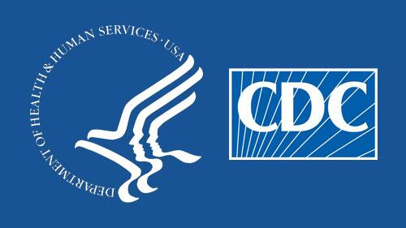
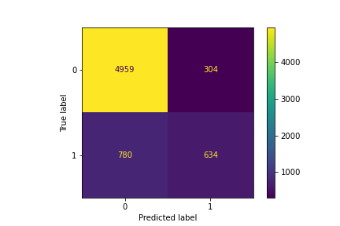
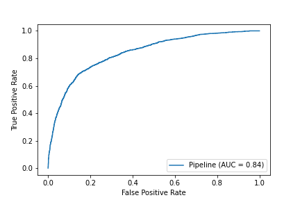
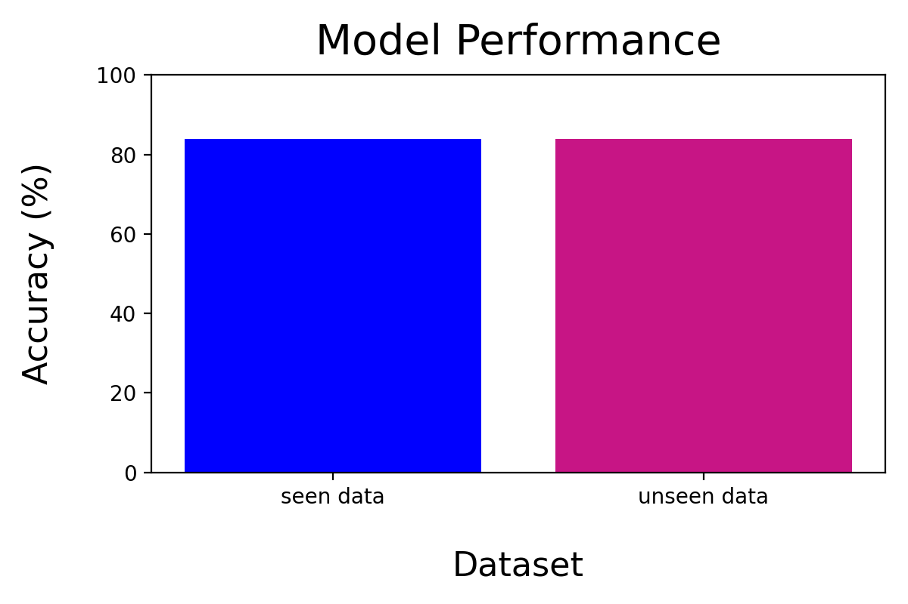

# Predicting seasonal Flu Shots



**Author**
Xiaohua Su [LinkedIn](www.linkedin.com/in/xiaohua-su) | [Email](mailto:xiaohuasu99@gmail.com)

## Overview
There is a need to increase vaccination rates in the US. The last pandemic which was the H1N1, it is estimated that only about 27% of the population had gotten the vaccine during that vaccine, according to data from the CDC. For other vaccines such as the covid-19, the most recent data from the Mayo clinic shows that only about 66% were fully inoculated even after 2 years of the pandemic. As such, it is critical for the CDC to identify who has gotten vaccinated for a particular vaccine. Having high vaccination rates will allow for another layer of safeguard against a certain disease by lowering the spread of it with the hopes of achieving herd immunity. With this added layer of protection for vaccine, people will not get severely sick from the disease or possibly die from it. As such, the CDC wants to create a model that can predict whether someone has gotten a vaccine as it is time consuming to try to go out and ask each individual if they’ve been vaccinated for a particular disease. Today, I will attempt to address this problem. I will present to you model that specifically predicts whether or not someone got a H1N1 vaccine during the 2009-2010 H1N1 pandemic as there is survey data available for this vaccine. 

## Problem
The CDC has tasked us to create a model that can accurately predict who has been vaccinated and who hasn't, in order to input into another model to locate these spots of where there is low vaccination rates. 

Using my model, we can predict whether an individual has been vaccinated or not. Using, this information, the CDC may be able to target individuals in specific locations to get vaccinated using outreach programs. 

## Data

The data that was used in to create the model was taken from [DrivenData](https://www.drivendata.org/competitions/66/flu-shot-learning/page/211/). In order to access the data from DrivenData, you'll need to create an account and sign up for the competition. The data is also available on this github in my [data folder](https://github.com/xiaohua-su/Predicting_H1N1_Vaccination/tree/main/data). This data was derived from the CDC’s. It contains basic information on the individual such as their education levels, `race`, `gender`, `age_group` and their opinions on the topic of H1N1 and Flu vaccine such effectiveness. Sensitive Information about the individual such as what region they’re located in, employment industry and occupation were already masked in this dataset. 

## Methods
This project use classifcation algorithms such as Logistic Regression, Decision trees and ensembles algorithms such as voting classification. Columns such as `race` was removed from the data set to ensure that when we pull out features and or interpret our model, it will not have this racial bias included in it. 


## Results
our best model was our random forest model that uses a rfe of 60.
The accuracy score is 84%.
The F1 score is about 0.56 which is lower than the training of 0.62.




The ROC-AUC is close to the training one. It's just lower than it by about 0.06. 




## Next Steps
Further tuning of model is needed to lower the misclassification of those that did or did not get the H1N1 vaccine. Not only that but refinement can be made to the data if access to the original dataset as the regions in which each individual was located is masked. As such, we are unable to do initial analysis on where those who were unvaccinated are. We would also want to test the model against the covid-19 vaccine confidence survey, as they have some of the same questions that was asked in the H1N1 survey, to see how well it’s able to predict if someone had the covid-19 vaccine to examine if it’s generalizable for other vaccines. 


## Conclusion

So, in conclusion, the model created was able to accurately predict whether someone had gotten the H1N1 vaccine or not about 84%. While this is good, further tuning of the model can be made, with more time and resources. Not only that, but with access to the region where the individual is located, I could make a model that can potentially predict locations of low vaccination rate. Testing the model against other vaccines such as COVID-19 will help make the model more generalizable as currently this model is optimized to look at the H1N1 vaccine specifically. It is difficult to be able to create a model that can generally predict who got a vaccine.The circumstances of when vaccines are implemented can vary and may be able to predict who got the vaccine better compared to a more general model. But a general model does have its own merits. My model today took a step towards creating such a generalizable predicting model that you the CDC are looking for to input into the a low vaccination hotspot model in order to target those inviduals. 

## Repository Structure
```
├── Workspace  
│       ├── EDA of H1N1.ipynb
│       ├── EDA.ipynb
│       ├── cleaned up-Copy1.ipynb    
│       ├── cleaned up.ipynb  
│       ├── final.ipynb
│       └── testing class python files.ipynb
│
├── data
├── image
├── H1N1 Vaccine Modeling.ipynb
├── H1N1 vaccine.pdf
├── README.md
├── get_features.py
└──model.py


```
### Additional information and citations

- Full analysis available in the project [Jupyter notebook](https://github.com/xiaohua-su/Predicting_H1N1_Vaccination/blob/main/H1N1%20Vaccine%20Modeling.ipynb)
- Presentation [presentation](https://github.com/xiaohua-su/Predicting_H1N1_Vaccination/blob/main/H1N1%20vaccine.pdf)
